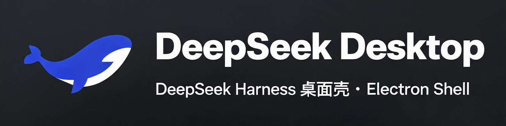

# DSH Desktop — DeepSeek Harness 桌面壳



DeepSeek Harness 的 Electron 桌面壳: 进程管理 + 自绘标题栏 + 资源挂接面板 + 皮肤系统 + 多语言。

## 功能

- **主窗口**: 内嵌 dsh web UI(127.0.0.1:3080), 原生 frame 可拖拽
- **自绘标题栏**: 鲸鱼 logo + 时段问候(自动按早上/中午/晚上切换) + 窗口控制(─□✕)
- **资源挂接**: 24 项 F盘资源路径配置(技能库/知识库/记忆中枢/MCP/ComfyUI 等), 启动校验存在性
- **模型中心**: API 模型(deepseek-v4-flash) + 本地 Ollama 模型检测/启动 + AI MODEL 目录
- **记忆中枢**: OpenMemory 健康检测/启动(localhost:8080)
- **皮肤系统**: 7 套语义 Token 皮肤(默认浅/深, Codex暗, Kanagawa, Solarized, Gruvbox, Berserk)
- **多语言**: 中文/粤语/蒙古语/藏语/维吾尔语/彝语 界面词条
- **Token 统计**: 官方 DeepSeek V3 tokenizer 精确计算会话 token(常驻 Python 进程)

## 架构

```
main/           Electron 主进程
  index.js      生命周期/单实例/首次引导
  backend.js    dsh 引擎进程管理(启动/健康检查/崩溃重启/日志)
  window.js     主窗口 + 控制面板 + IPC
  config.js     配置(深合并, %APPDATA%/dsh-desktop/config.json)
  tokenizer.js  官方 tokenizer 常驻进程桥
  tray.js       系统托盘
preload/        安全桥(contextBridge)
renderer/       壳面板 UI + ui-inject(主窗口注入) + skins + lang-packs
scripts/        PowerShell 辅助脚本
```

## 安装运行

```powershell
# 1. 安装 dsh 引擎
#    参考 https://github.com/deepseek-ai/deepseek-harness
#    部署到本地目录, 在系统设置中配置 enginePath

# 2. 安装壳依赖
pnpm install

# 3. 运行
pnpm start
```

首次启动: 未配置 enginePath 时自动打开控制面板, 在"系统设置"中填写 dsh 引擎路径与 API 配置。

## 配置

配置文件: `%APPDATA%\dsh-desktop\config.json`(首次运行自动生成, 含个人路径, 已被 .gitignore 排除)

| 键 | 说明 |
|:---|:-----|
| enginePath | dsh 引擎目录(含 package.json) |
| port | dsh web 端口(默认 3080) |
| api.model / api.keyEnv | 模型名与密钥环境变量 |
| om.url / om.apiKey | OpenMemory 地址与 API Key(可选) |
| mounts.* | 24 项资源挂接路径 |
| skin / lang / userName | 皮肤/语言/用户名 |

## 皮肤系统

皮肤 = `--dsw-alias-*` 语义 Token 覆盖集(与 dsh 官方 token 体系对齐), 通过 executeJavaScript 注入 `:root`。新增皮肤: 在 `renderer/skins.js` 加一个 token 集即可。

## 多语言

词条表 `renderer/lang-packs.js`, 界面文案按语言映射替换。新增语言: 在 LANG_PACKS 加一个语言键。

## 安全说明

- 所有密钥/个人路径存于 `%APPDATA%/dsh-desktop/config.json`(git 忽略), 不进代码
- OM API Key 从配置读取, 不硬编码
- Ollama 路径自动检测常见安装位置
- 引擎目录 .env 保存 API 密钥(壳设置页写入)

## 关联

- 引擎: https://github.com/deepseek-ai/deepseek-harness
- 皮肤方法论: 品鉴系统 · 成游-UI换肤设计
